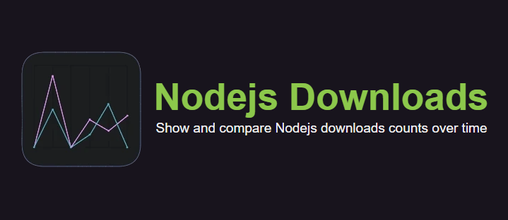

## Nodejs compare - Show and compare Nodejs download counts over time



Compare Nodejs is a website that allows you to show and compare the downloads of Nodejs in different countries and different days or months.

**Here you can see the application deployed in production:**

- https://nodejs-compare.vercel.app/

## How to run locally?

You will need to have `Node.js` (preferly v18) installed and have access to a terminal to follow
the following steps:

```
npm run dev # Run the application in development mode
```

## All pull requests are welcome

- **Follow the style and run the linter before making the PR**.
- **The idea is that the app is functional and has the minimum necessary.**
- **Refactorings and Tests are welcome.**

## Próximas características

- [ ] 🔹 Selected range of dates for see downloads in past

